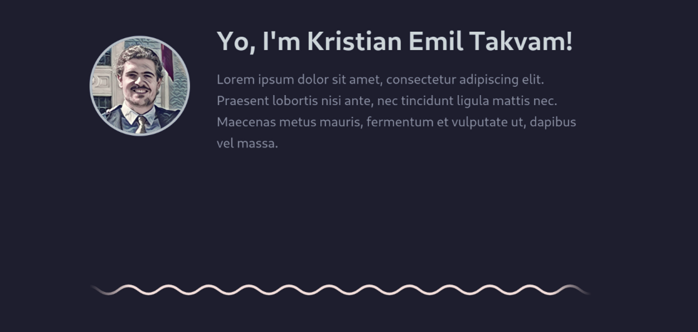

  

---

   

Heres the repo for my personal website!

---
###### *Built with the <a href="https://github.com/trueberryless-org/astro-portfolio-template" target="_blank">Astro-portfolio-template</a> theme by <a href="https://trueberryless.org/" target="_blank">@trueberryless</a> (MIT License)*
